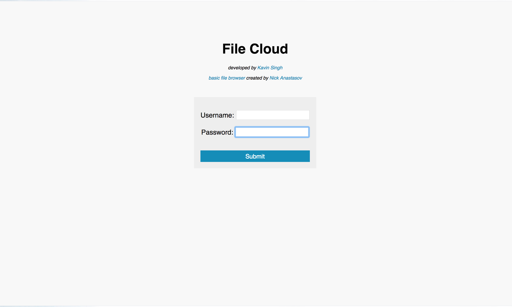
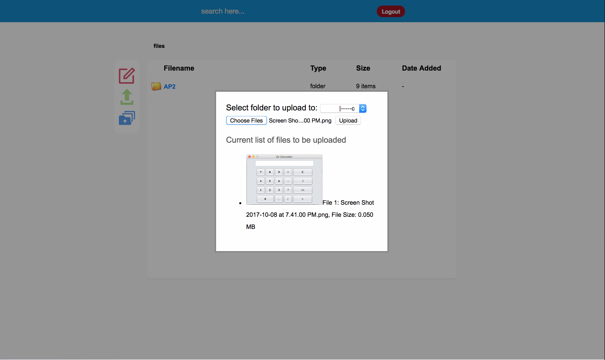
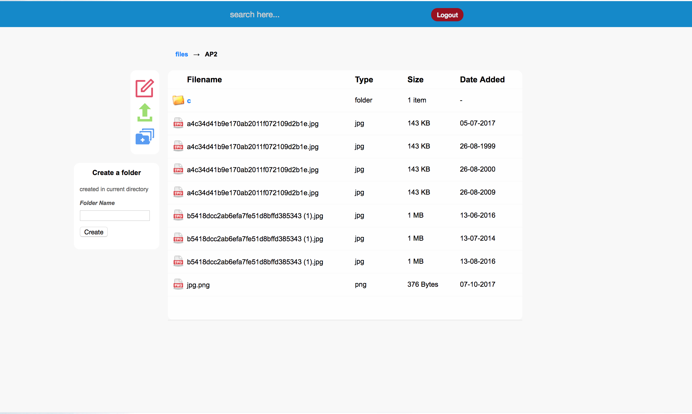
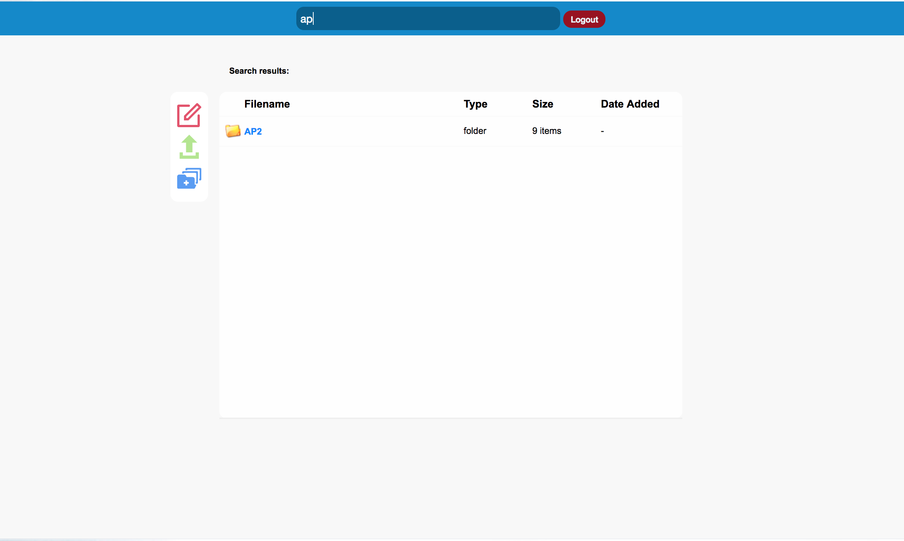
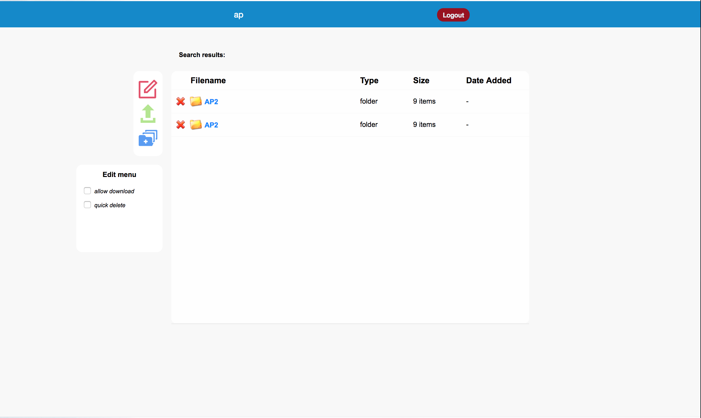

# Online-File-Cloud
This beginner project is an online file manager where you can store files in a cloud to be retrieved anywhere in the world. In this project main coding was done in Javascript and only a little in PHP.

Any feedback is highly appreciated!

## Features
  1. Upload Files
     - Image Preview (on upload)
  2. Create Folders
  3. Delete Files
  4. Download Files
  5. File/Folder Search
  6. Name/Date/Type/Size Sort
 

## Setting It Up --No Database Required--
Setting it up is relatively simple.
1. Open up 'index.php' and set your `username` and `password` in the array.
2. Upload code all inside 'local' folder to a server that has PHP installed in. 
3. Voila!

## Screenshots

  
#### NOTE
This file manager currently does not have sufficient security implemented to project your files and server. 
It's recommended to use it in a local server.

#### DISCLAIMER
'Folder Create' Icon made by Freepik from www.flaticon.com
'Upload' Icon made by Elegant Themes from www.flaticon.com
'Edit' Icon made by Rami McMin from www.flaticon.com

File Manager algorithm created by: https://tutorialzine.com/@nick
